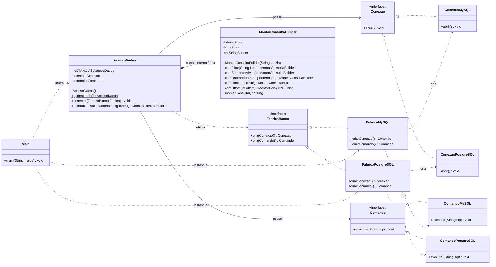

```mermaid

classDiagram
    direction LR

    class Main {
        +main(String[] args)$ void
    }

    class FabricaBanco {
        <<interface>>
        +criarConexao() Conexao
        +criarComando() Comando
    }

    class FabricaMySQL {
        +criarConexao() Conexao
        +criarComando() Comando
    }

    class FabricaPostgreSQL {
        +criarConexao() Conexao
        +criarComando() Comando
    }

    class Conexao {
        <<interface>>
        +abrir() void
    }

    class Comando {
        <<interface>>
        +executar(String sql) void
    }

    class ConexaoMySQL {
        +abrir() void
    }

    class ComandoMySQL {
        +executar(String sql) void
    }

    class ConexaoPostgreSQL {
        +abrir() void
    }

    class ComandoPostgreSQL {
        +executar(String sql) void
    }

    class AcessoDados {
        -INSTANCIA$ AcessoDados
        -conexao Conexao
        -comando Comando
        -AcessoDados()
        +getInstancia()$ AcessoDados
        +conectar(FabricaBanco fabrica) void
        +montarConsultaBuilder(String tabela) MontarConsultaBuilder
    }

    class MontarConsultaBuilder {
        -tabela String
        -filtro String
        -sb StringBuilder
        +MontarConsultaBuilder(String tabela)
        +comFiltro(String filtro) MontarConsultaBuilder
        +comSomenteAtivos() MontarConsultaBuilder
        +comOrdenacao(String ordenacao) MontarConsultaBuilder
        +comLimite(int limite) MontarConsultaBuilder
        +comOffset(int offset) MontarConsultaBuilder
        +montarConsulta() String
    }

    %% Abstract Factory
    FabricaBanco <|.. FabricaMySQL
    FabricaBanco <|.. FabricaPostgreSQL

    %% Produtos abstratos e concretos
    Conexao <|.. ConexaoMySQL
    Conexao <|.. ConexaoPostgreSQL

    Comando <|.. ComandoMySQL
    Comando <|.. ComandoPostgreSQL

    %% Fabricas criam seus produtos
    FabricaMySQL ..> ConexaoMySQL : cria
    FabricaMySQL ..> ComandoMySQL : cria

    FabricaPostgreSQL ..> ConexaoPostgreSQL : cria
    FabricaPostgreSQL ..> ComandoPostgreSQL : cria

    %% Singleton / acesso a dados
    AcessoDados --> Conexao : possui
    AcessoDados --> Comando : possui
    AcessoDados ..> FabricaBanco : utiliza

    %% Builder
    AcessoDados *-- MontarConsultaBuilder : classe interna / cria

    %% Main
    Main ..> AcessoDados : utiliza
    Main ..> FabricaMySQL : instancia
    Main ..> FabricaPostgreSQL : instancia
```
